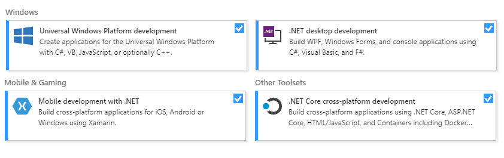
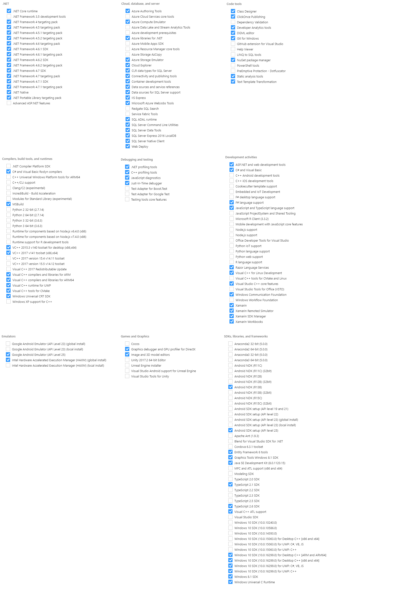

# Prepare your development environment

This document describes how to prepare your development environment to build and use the **Microsoft Azure IoT device client SDK for .NET**

1.  [Prerequisites required to build the SDK](#min_setup)
2.  [Optional prerequisites required to test Xamarin and Windows IoT(#advanced)
3.  [Test prerequisites](#testprereq)

<a name="min_setup"/>

## Prerequisites required to build the SDK

The following prerequisites are the minimum required to build and produce IoT SDK binaries. Visual Studio is not required to build the SDK.
This may not be sufficient to run certain samples that require Visual Studio and other SDKs or frameworks installed on your machine.

### Windows + .NET Framework

- Install the latest .NET from https://dot.net
- Install .NET Framework 4.7.2 Developer Pack: https://dotnet.microsoft.com/download/dotnet-framework/net472
- As admin (one-time setup):
    Enable Powershell script execution on your system. See http://go.microsoft.com/fwlink/?LinkID=135170 for more information.
    `Set-ExecutionPolicy -ExecutionPolicy RemoteSigned`

### Linux/OSX

- Install Powershell https://docs.microsoft.com/en-us/powershell/scripting/install/installing-powershell?view=powershell-6
- Install the latest .NET Core SDK CLI https://dotnet.microsoft.com/download

<a name="advanced"/>

## Optional Setup required to test Xamarin, Windows IoT

### Installing Visual Studio for Xamarin applications

- Install [Visual Studio][visual-studio]. You can use the **Visual Studio Community** Free download if you meet the licensing requirements.
- During the installation of Visual Studio, we found that selecting the following workloads and components helps in running and debugging the SDK.

Workloads:


Components:


### Installing Windows IoT Core SDK

Install the Microsoft IoT Windows Core Project Templates for Visual Studio 2017+ from the Extension Marketplace:
    https://marketplace.visualstudio.com/items?itemName=MicrosoftIoT.WindowsIoTCoreProjectTemplatesforVS15

### [Deprecated] Installing .NET Micro Framework

```diff
- .NET MicroFramework is no longer supported in the SDK.
```

<a name="testprereq"/>

## Test prerequisites

Each test project that requires additional changes to your machine contains a `prerequisites` folder. Please follow the instructions within that folder on how to set-up your machine in order to successfully run our tests.

#### iothub/service/prerequisites one-time setup (Windows Only)
Run the following as admin: `iothub\service\tests\prerequisites\windows_install.cmd`

#### e2e/test/prerequisites

1. Create copies of the prerequisite scripts in a separate folder (optionally include this folder in your PATH environment variable for easy access. 

    * Windows: copy `e2e/test/prerequisites/iot_config.cmd_template` to a folder in your PATH `iot_config.cmd`
    * Linux/OSX: copy `e2e/test/prerequisites/iot_config.sh_template` to `iot_config.sh`

**Do not** check-in these files after you have edited them as they contain your account's secrets such as connection strings.

2. Add the variables to your environment

    * Windows: run `iot_config.cmd`
    * Linux: dot-source the config file: `. iot_config.sh` 

3. Run the e2e tests or launch Visual Studio from the same command prompt/terminal.

[visual-studio]: https://www.visualstudio.com/
[readme]: ../readme.md
[lnk-sdk-vs2015]: http://go.microsoft.com/fwlink/?LinkId=518003
[lnk-sdk-vs2013]: http://go.microsoft.com/fwlink/?LinkId=323510
[lnk-sdk-vs2012]: http://go.microsoft.com/fwlink/?LinkId=323511
[lnk-visualstudio-xamarin]: https://msdn.microsoft.com/en-us/library/mt299001.aspx
[lnk-NuGet-package]:https://www.nuget.org/packages/Microsoft.Azure.Devices.Client
[lnk-NuGet-package_pcl]:https://www.nuget.org/packages/Microsoft.Azure.Devices.Client.PCL
[lnk-azure-iot]:https://github.com/Azure/azure-iot-sdks
[NuGet-Package-Manager]:https://visualstudiogallery.msdn.microsoft.com/5d345edc-2e2d-4a9c-b73b-d53956dc458d
[NuGet]:https://www.nuget.org/
[PCL]:https://msdn.microsoft.com/en-us/library/gg597391(v=vs.110).aspx
[UWP]:https://msdn.microsoft.com/en-us/windows/uwp/get-started/universal-application-platform-guide
[.NET]:https://www.microsoft.com/net
[UWP]:https://msdn.microsoft.com/en-us/windows/uwp/winrt-components/index
[Xamarin]:https://www.xamarin.com/
