# Long haul test results

This document describes long haul test results for Azure IoT SDK for C# v2. The results are based on 4 IoT Hub devices (MQTT/TCP, MQTT/WS, AMQP/TCP, AMQP/WS) and 2 IoT Edge modules (MQTT/TCP, AMQP/TCP). These tests ran for 64 hours.
These long haul tests are based on executing different operations like c2d messages, direct method, telemetry messages, feedback messages and file uploads to service client. Each of these operations is executed over regular intervals and logs the accumulated total count of the operations and the time it takes for successful completion. The graphs used here are results of Kusto queries executed over these collected logs.

## Table of contents

- [IoT Hub device client test results](#IoT-Hub-device-client-test-results)
- [IoT Edge module client test results](#IoT-Edge-module-client-test-results)
- [IoT Hub service client test results](#IoT-Hub-service-client-test-results)

## IoT Hub device client test results

### Garbage collector available bytes

The tests keep track of total available garbage collector bytes. This allows for detecting any memory leaks in the program. No significant memory leaks were observed during the tests. The screenshot below shows data from garbage collector over all the 4 devices used in the tests.
The data shows consistent size of available garbage collector bytes.

### Desired twin and C2D messages handled

Each device in the test receives desired twin properties updates and C2D messages every 3 seconds from service. The screenshot below shows data collected over all 4 devices used in the tests. The graph is not a linear curve due a bug in MQTT implementation where desired twin properties and c2d messages were not being parsed correctly. This test helped us find and resolve the issue.

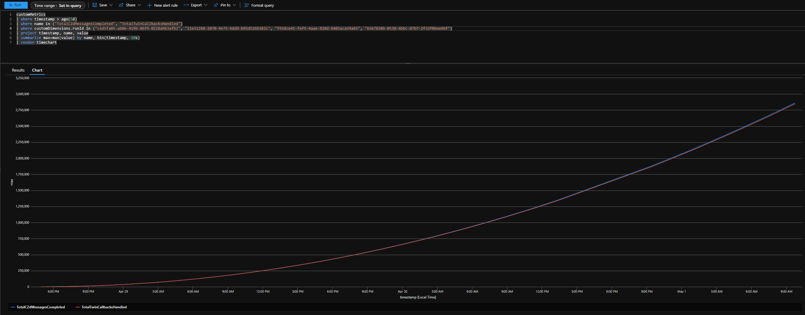

### Reported twin and Telemetry sent

Each device requests reported twin properties every 10 seconds and sends telemetry message to service every 3 seconds. The graph for both is linear and the difference in slope is due to the difference in time interval for both operations.

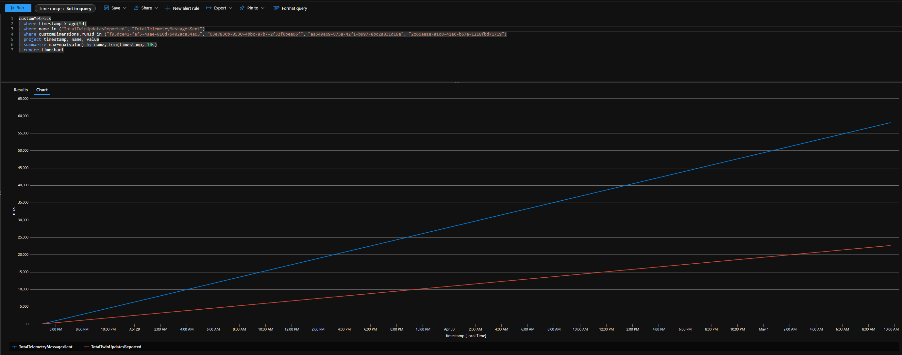

### Disconnection Duration

MQTT protocol has a limitation where the device disconnects before token refresh and then reconnects. The device client sets TTL to 60 minutes by default, thus we see a reconnection after every ~55 minutes. The graph below shows the time duration (seconds) for which MQTT device is disconnected. Apart from a few exceptions, devices reconnect within 1 second.

### Telemetry Message Backlog

Each device creates and sends telemetry messages to service every 3 seconds. If for some reason a message is not completed before its time to send a new telemetry message, the new message is stored in queue to be processed whenever possible. The graph below shows size of telemetry message backlog. The size of backlog queue always stayed at zero with few exceptions where it increased to size of 1 or 2. This is mostly due to when MQTT devices were reconnecting while a telemetry message was ready to be sent. Thus as soon as the device is connected again, backlogged telemetry messages are processed.

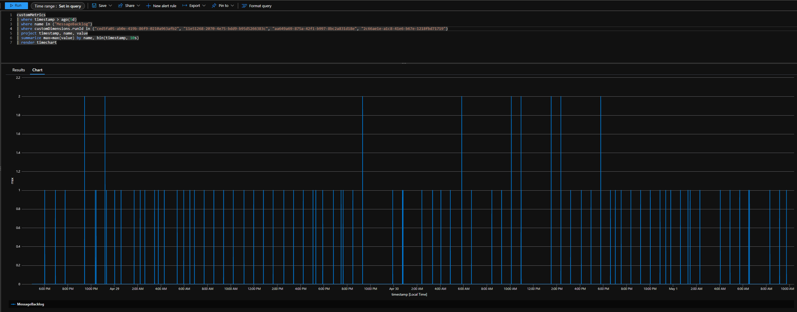

### Telemetry message delay

Each device logs the time (seconds) it takes to successfully send a telemetry message to service. The graph below observes time < 1s to send telemetry message with exceptions where a device was reconnecting. None of such instances took more than 6 seconds.

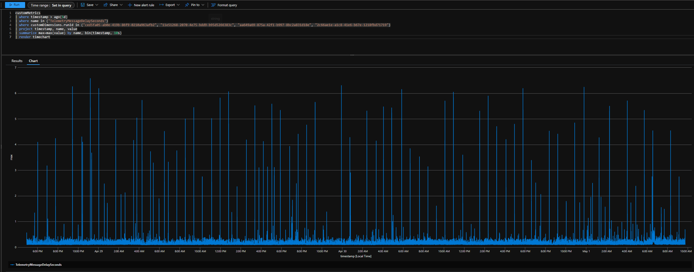

### Reported twin update delay

Each device logs the time (seconds) it takes to successfully receive reported twin updates. The graph below observes time < 1s to receive reported twin updates with exceptions where a device was reconnecting.

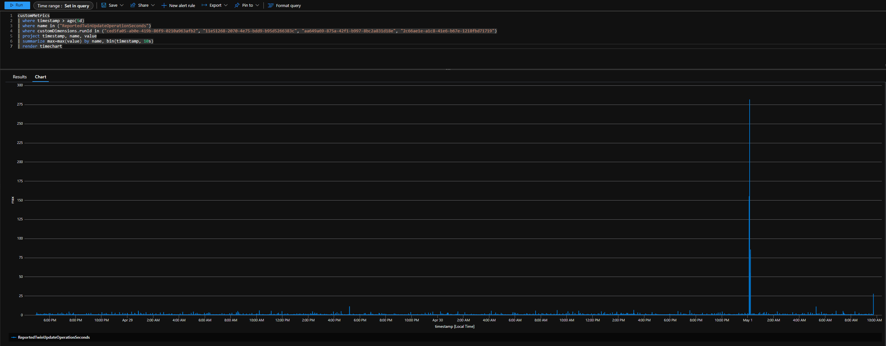

### Direct method delay

Each device logs the time (seconds) it takes to successfully receive direct method from service. The graph below observes time < 1s to receive direct method with exceptions where a device was reconnecting and the delay was ~5-6 seconds.

### C2D message delay

Each device logs the time (seconds) it takes to successfully receive c2d message from service. The graph below observes time < 1s to receive c2d message with exceptions where a device was reconnecting and the delay was ~5-6 seconds.

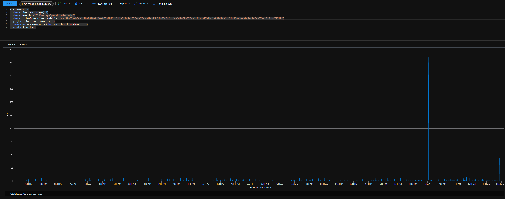

## IoT Edge module client test results

### Garbage collector available bytes

The tests keep track of total available garbage collector bytes. This allows for detecting any memory leaks in the program. No significant memory leaks were observed during the tests. The screenshot below shows data from garbage collector over 2 edge modules used in the tests.
The data shows consistent size of available garbage collector bytes.

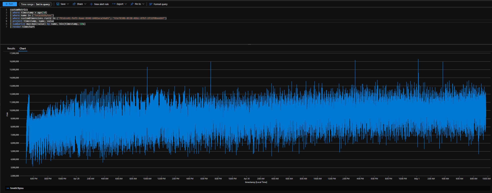

### Disconnection Duration

MQTT protocol has a limitation where the device disconnects before token refresh and then reconnects. The device client sets TTL to 60 minutes by default, thus we see a reconnection after every ~55 minutes. The graph below shows the time duration (seconds) for which MQTT devices disconnects. Apart from a single exception, edge module reconnect within 1 second.

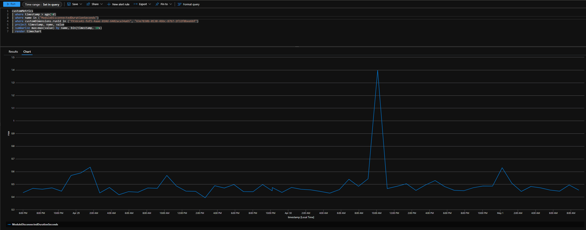

### Telemetry Message Backlog

Each edge module creates and sends telemetry messages to service every 3 seconds. If for some reason a message is not completed before its time to send a new telemetry message, the new message is stored in queue to be processed whenever possible. The graph below shows size of telemetry message backlog. The size of backlog queue always stayed at zero with few exceptions where it increased to size of 1 or 2. This is mostly due to when MQTT edge module was reconnecting while a telemetry message was ready to be sent. Thus as soon as the edge module is reconnected, backlogged telemetry messages are processed.

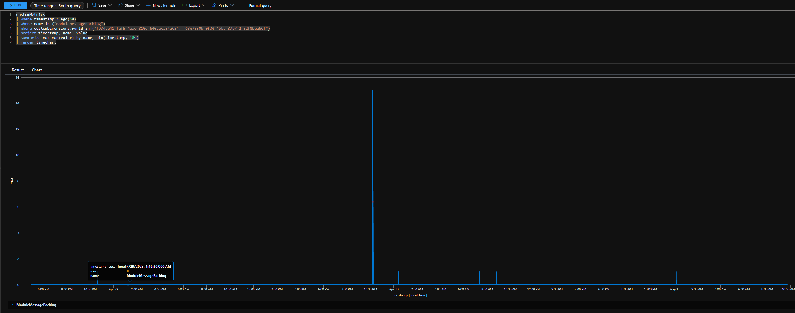

### Telemetry sent, Reported twin and Desired twin updates

Each edge module sends telemetry message to service, receives desired twin properties update and requests reported twin properties. The graph shows linear curves for all the metrics with difference in slope due to interval difference for the operations.

### Telemetry message delay

Each edge module logs the time (seconds) it takes to successfully send a telemetry message to service. The graph below observes time < 1s to send telemetry message with exceptions where an edge module was reconnecting. None of such instances took more than 6 seconds.

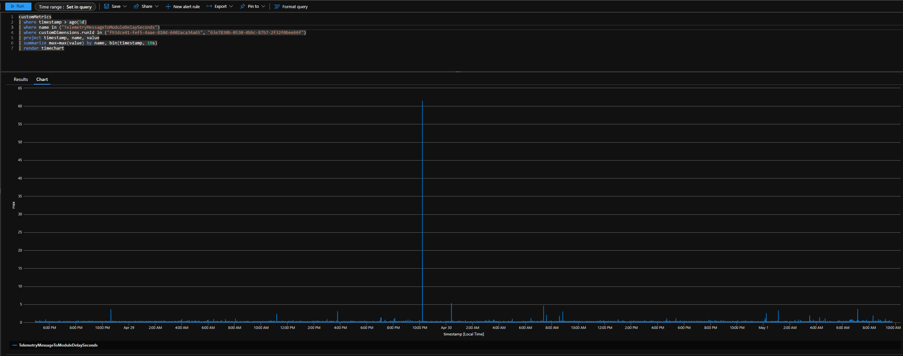

### Reported twin update delay

Each edge module logs the time (seconds) it takes to successfully receive reported twin updates. The graph below observes time < 1s to receive reported twin updates with exceptions where an edge module was reconnecting.

### Direct method delay

Each edge module logs the time (seconds) it takes to successfully receive direct method from service. The graph below observes time < 1s to receive direct method with exceptions where an edge module was reconnecting.

## IoT Hub service client test results

### Garbage collector available bytes

The tests keep track of total available garbage collector bytes. This allows for detecting any memory leaks in the program. No significant memory leaks were observed during the tests. The screenshot below shows data from garbage collector over service client used in the tests.
The data shows consistent size of available garbage collector bytes. The range of garbage collector size if comparatively larger as the service client was responsible for executing operations over all IoT Hub devices and IoT Edge modules. 

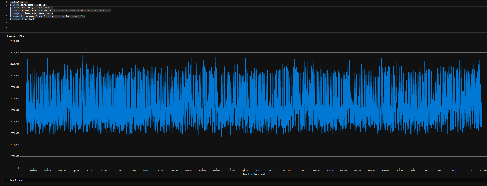

### Service client operations over IoT Hub devices

The service client executes c2d messages, desired twin properties updates, direct methods, receives feedback messages and receives file upload notifications from each IoT Hub device. The graph below shows data from all these operations and all operations show consistent behavior over long period of time.

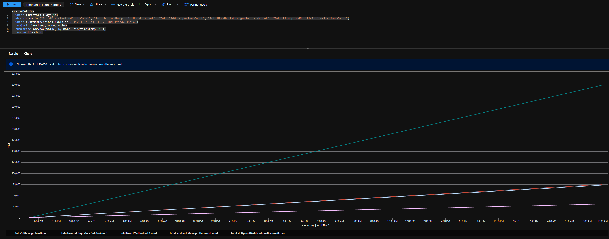

### c2d message round trip delay over IoT Hub devices

The service client logs the round trip time (seconds) it takes each c2d message. The graph below observes time < 1s for c2d message round trip.

### Desired twin update round trip delay over IoT Hub devices

The service client logs the round trip time (seconds) it takes to request desired twin properties and receive updated twin from each device. The graph below observes average time of 1.5s - 2s.

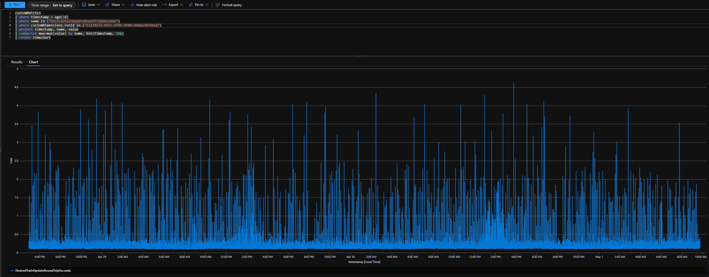

### Direct method round trip delay over IoT Hub devices

The service client logs the round trip time (seconds) it takes to execute direct method and receive response from each device. The graph below observes average time of 1.5s - 2s.

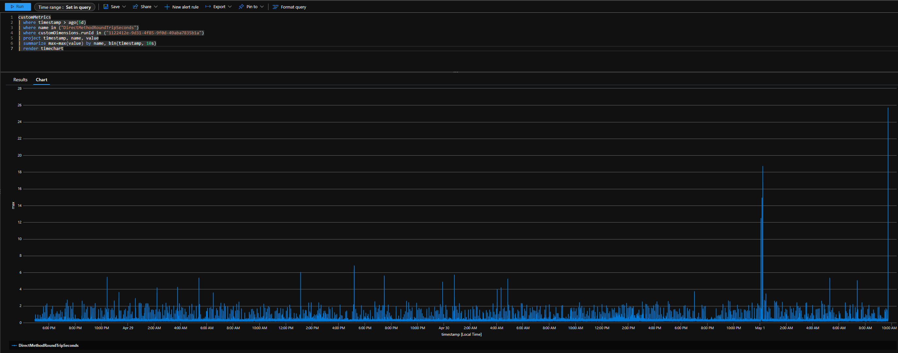

### Service client operations over IoT Edge modules

The service client executes direct methods and desired twin properties updates over each IoT Edge module. The graph below shows data from all these operations and all operations show consistent behavior over long period of time.

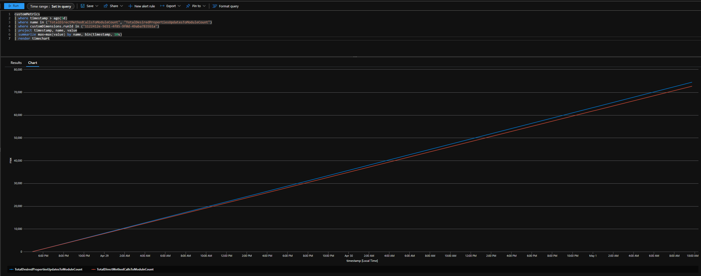

### Desired twin update round trip delay over IoT Edge modules

The service client logs the round trip time (seconds) it takes to request desired twin properties and receive updated twin from each edge module. The graph below observes average time of 1.5s - 2s.

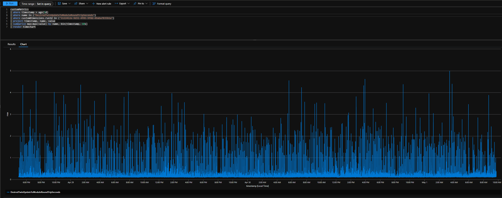

### Direct method round trip delay over IoT Edge modules

The service client logs the round trip time (seconds) it takes to execute direct method and receive response from each edge module. The graph below observes average time of 1.5s - 2s.

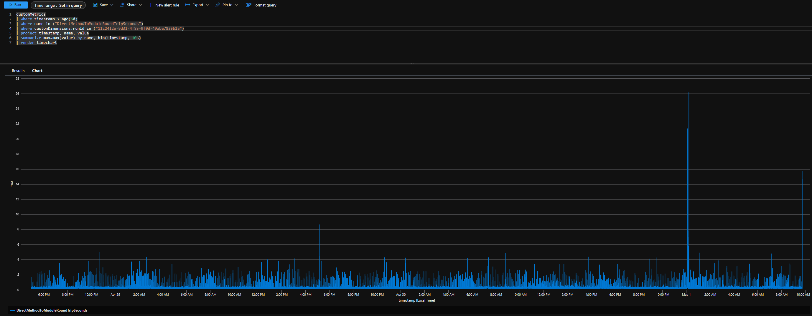