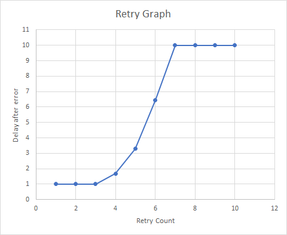

# Default RetryPolicy

The default retry policy is defined by the following:
`new ExponentialBackoff(int.MaxValue, TimeSpan.FromMilliseconds(100), TimeSpan.FromSeconds(10), TimeSpan.FromMilliseconds(100));`

To avoid high CPU usage, the retries are throttled if the code fails immediately (e.g. when there is no network or route to destination) so that the minimum time to execute the next retry is 1 second.

The following graph shows how much delay is _added_ after the initial I/O call failed with a transport error:

__Versions below 1.19.0 only:__ If the service is responding with a throttling error, the retry policy is different and cannot be changed via public API:
`new ExponentialBackoff(RetryCount, TimeSpan.FromSeconds(10), TimeSpan.FromSeconds(60), TimeSpan.FromSeconds(5))`

The retry mechanism will stop after `DefaultOperationTimeoutInMilliseconds` which is currently set at 4 minutes.
