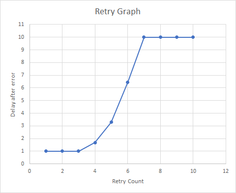

# Default RetryPolicy

The default retry policy is defined by the following:
`new ExponentialBackoff(int.MaxValue, TimeSpan.FromMilliseconds(100), TimeSpan.FromSeconds(10), TimeSpan.FromMilliseconds(100));`

To avoid high CPU usage, the retries are throttled if the code fails immediately (e.g. when there is no network or route to destination) so that the minimum time to execute the next retry is 1 second.

The following graph shows how much delay is _added_ after the initial I/O call failed with a transport error:


__Versions below 1.19.0 only:__ If the service is responding with a throttling error, the retry policy is different and cannot be changed via public API:
`new ExponentialBackoff(RetryCount, TimeSpan.FromSeconds(10), TimeSpan.FromSeconds(60), TimeSpan.FromSeconds(5))`

The retry mechanism will stop after `DefaultOperationTimeoutInMilliseconds` which is currently set at 4 minutes.

The SDK also provides a `NoRetry` implementation of the `IRetryPolicy`. This can be used if you do not want the client to retry after getting disconnected.

You can also supply your custom retry policy to the `DeviceClient` by implementing the `IRetryPolicy` interface.

``` C#
public class MyCustomRetryPolicy : IRetryPolicy
{
    /// <summary>
    /// Returns true if, based on the parameters, the operation should be retried.
    /// </summary>
    /// <param name="currentRetryCount">How many times the operation has been retried.</param>
    /// <param name="lastException">Operation exception.</param>
    /// <param name="retryInterval">Next retry should be performed after this time interval.</param>
    /// <returns>True if the operation should be retried, false otherwise.</returns>
    public bool ShouldRetry(int currentRetryCount, Exception lastException, out TimeSpan retryInterval)
    {
        // Implement your retry strategy here
    }
}

deviceClient.SetRetryPolicy(new MyCustomRetryPolicy(...));
```
