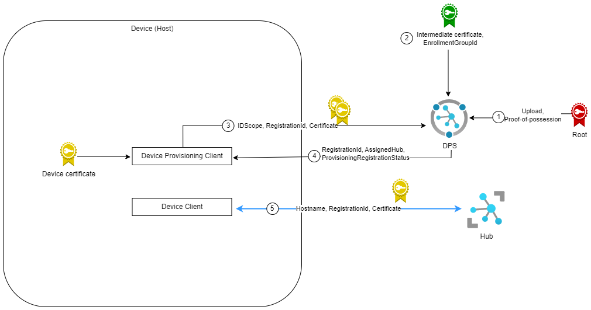

# Best Practice Solution Sample with X.509 Authentication

## Objective

This document demonstrates a real-world example to help you get started with building your own custom IoT cloud solution with X.509 certificate-based authentication. See [here](https://learn.microsoft.com/azure/iot-dps/concepts-service#attestation-mechanism) to review available attestation mechanisms.

## Example

Contoso is a manufacturing company that wants to manage various types of products remotely.

The business needs of Contoso are:

- Provision devices securely at scale.
- Group devices by production line.
- Collect data from devices.
- Manage devices remotely (e.g., controlling the temperature of a thermostat).

## Recommended Solution


> **Note**\
> The Device Process is the device (host) application that holds the provisioning client and IoT hub communication code.

### Prerequisites

1. Create a resource group and one or more IoT hubs.
2. Set up an IoT hub Device Provisioning Service (DPS) instance.
3. Link the IoT hub(s) to the DPS instance.
See [here](https://learn.microsoft.com/azure/iot-dps/quick-setup-auto-provision) for the instructions.
4. Install OpenSSL for Windows and Azure Cli.

## Warning

The provided script, [X509DpsSetup.ps1](https://github.com/Azure/azure-iot-sdk-csharp/tree/previews/v2/provisioning/device/samples/solutions/BestPracticeSampleX509/X509DpsSetup.ps1) creates X.509 test certificates. They are provided for demonstration purposes only and **MUST NOT** be used for production. For a production environment, we recommend using X.509 certificate authority (CA) certificates and your own best practices for certificate lifetime management. To read more about X.509 CA certificates, see [here](https://learn.microsoft.com/en-us/azure/iot-hub/iot-hub-x509ca-concept).

### Generate test certificates and verify root certificate

1. Create a secure string password to use in the creation of self-signed certificates. Open Windows PowerShell as administrator.

```powershell
    $password = ConvertTo-SecureString <your password> -AsPlainText -Force
```

2. [X509DpsSetup.ps1](https://github.com/Azure/azure-iot-sdk-csharp/tree/previews/v2/provisioning/device/samples/solutions/BestPracticeSampleX509/X509DpsSetup.ps1) creates the root, intermediate, device certificate, and uploads the root certificate to your DPS instance, and performs proof-of-possession. Your device Id is set to the subject of the common name of the device certificate and the registration Id in DPS.

```powershell
    .\X509DpsSetup.ps1 `
        -certFolderPath <Path where certificates will be placed> `
        -rootCertPassword $password `
        -dpsResourceGroup <DPS instance resource group> `
        -dpsName <DPS instance name> `
        -deviceId <device Id>
```

[X509DpsSetup.ps1](https://github.com/Azure/azure-iot-sdk-csharp/tree/previews/v2/provisioning/device/samples/solutions/BestPracticeSampleX509/X509DpsSetup.ps1) first issues a root certificate. Then it uses the root certificate to generate a unique intermediate certificate for each product line. Finally, it uses the production line certificate, to generate a unique device (end-entity) certificate for each device manufactured on the line.

> **Note**\
> Read more about X.509 certificate attestation [here](https://learn.microsoft.com/azure/iot-dps/concepts-x509-attestation).
> To learn more about the parameters used in the Export-PfxCertificate command, read [here](https://learn.microsoft.com/powershell/module/pki/export-pfxcertificate?view=windowsserver2022-ps#-password).
> For more details about the proof-of-possession process, see [here](https://learn.microsoft.com/azure/iot-hub/iot-hub-x509ca-concept#proof-of-possession) and [here](https://learn.microsoft.com/azure/iot-dps/how-to-verify-certificates).
> See [here](https://learn.microsoft.com/azure/iot-dps/concepts-service#registration-id) for device Id format.

### Create a DPS enrollment with an intermediate certificate

An enrollment group is a group of devices that share a specific attestation method. The enrollment group supports X.509 certificate attestation. Devices in an X.509 enrollment group present X.509 device certificates that have been signed by the same intermediate certificate.

We will use the generated intermediate certificate to group devices by production lines. See [here](https://learn.microsoft.com/azure/iot-dps/concepts-x509-attestation#why-are-intermediate-certs-useful) to read more about intermediate certificates.

[X509DpsSetup.ps1](https://github.com/Azure/azure-iot-sdk-csharp/tree/previews/v2/provisioning/device/samples/solutions/BestPracticeSampleX509/X509DpsSetup.ps1) creates an enrollment group in your DPS instance using the generated intermediate certificate.
You can specify initial twin state, provisioning status, device capabilities, IoT hub name, eTag, etc. To learn more about these optional parameters, see [here](https://learn.microsoft.com/cli/azure/iot/dps/enrollment-group?view=azure-cli-latest#az-iot-dps-enrollment-group-create).

### Provision a device through DPS and connect to IoT Hub

In this step, we will use the chained device certificate to provision a device to an IoT Hub using the enrollment group. Devices provisioned through the same enrollment group will share the same initial configuration and will be assigned to one of the linked IoT Hub(s).

1. Obtain the IDScope of the DPS instance from Azure Portal.
2. From terminal, navigate to the [X509 sample folder](</provisioning/device/samples/getting started/X509Sample>) (where the .csproj file lives). Copy and paste the device certificate pfx file. Then execute the following command and check for build errors:

```powershell
    dotnet build
```

3. Set the IdScope, device certificate, and certificate password and run the sample. This will assign a device to an IoT hub and connect to the IoT hub and send a sample telemetry message. Check the log for the assigned IoT hub hostname.

```powershell
    dotnet run --s <IdScope> --n <Device certificate pfx file> --p <your password>
```

4. From terminal, navigate to the [device reconnection sample folder](</iothub/device/samples/how to guides/DeviceReconnectionSample>). Read [readme.md](</iothub/device/samples/how to guides/DeviceReconnectionSample/readme.md>) to learn how to initialize the device client, send device to cloud telemetry, receive cloud to device message, receive twin desired property update notifications, and update device twin's reported properties.

Open [DeviceReconnectionSample.cs](</iothub/device/samples/how to guides/DeviceReconnectionSample/DeviceReconnectionSample.cs>) in code editor. Find

```csharp
s_deviceClient = new IotHubDeviceClient(_deviceConnectionStrings.First(), _clientOptions);
```

and replace it with

```csharp
var deviceCert = new X509Certificate2(_certificatePath, _certificatePassword);
var auth = new ClientAuthenticationWithX509Certificate(deviceCert, _deviceId);
s_deviceClient = new IotHubDeviceClient(_hostname, auth, _clientOptions);
```

Then execute the following command and check for build errors:

```powershell
    dotnet build
```

5. Set the IoT hub hostname, device Id, device certificate password and path and run the sample.

```powershell
    dotnet run --h <assigned IoT hub hostname> --d <device Id> --p <your password> --n <path to device certificate pfx file>
```


> **Note**\
> To learn more about device twins, see [here](https://learn.microsoft.com/azure/iot-hub/iot-hub-devguide-device-twins).

### Optional - Clean-up

[Cleanup.ps1](https://github.com/Azure/azure-iot-sdk-csharp/tree/previews/v2/provisioning/device/samples/solutions/BestPracticeSampleX509/Cleanup.ps1) will remove the enrollment group in your DPS instance and the device in the IoT hub.

```powershell
    .\Cleanup.ps1 `
        -resourceGroup <resource group> `
        -dpsName <DPS instance name> `
        -iothubName <IoT hub instance name> `
        -deviceId <device Id>
```

## Read More

- [Security recommendations for Azure Internet of Things (IoT) deployment](https://learn.microsoft.com/azure/iot-fundamentals/security-recommendations)
- [Best practices for large-scale IoT device deployments](https://learn.microsoft.com/azure/iot-dps/concepts-deploy-at-scale)
- [Security practices for Azure IoT device manufacturers](https://learn.microsoft.com/azure/iot-dps/concepts-device-oem-security-practices)
- [X.509 certificate attestation](https://learn.microsoft.com/azure/iot-dps/concepts-x509-attestation)
- [Create an X.509 enrollment group with DPS service SDK](https://learn.microsoft.com/azure/iot-dps/quick-enroll-device-x509?pivots=programming-language-csharp)